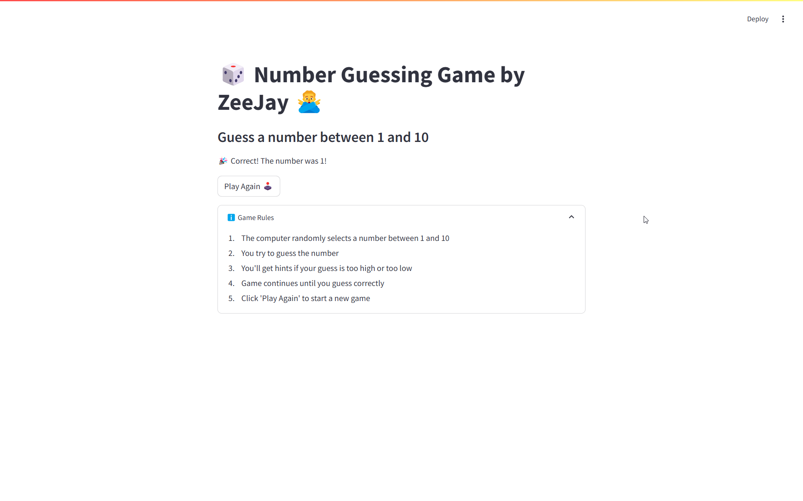

# 🎲 Number Guessing Game by ZeeJay 🙅‍♂️  

A fun **interactive number guessing game** built using **Python** and **Streamlit**!  
Can you guess the **randomly selected number** between **1 and 10**? Let's play! 🎮  

---

## 🌟 **Features**  
✅ **Intuitive UI** – Simple, easy-to-use interface.  
✅ **Live Feedback** – Tells you if your guess is **too high** 📈 or **too low** 📉.  
✅ **🎉 Winning Animation** – Balloons pop when you guess correctly!  
✅ **One-Click Restart** – Press **Play Again 🕹️** to start fresh.  
✅ **📖 Rules Section** – Built-in game instructions.  

---

## 🚀 **How to Run the App**  

### 1️⃣ Install Streamlit (if not already installed)  
```sh
pip install streamlit
```

### 2️⃣ Run the App  
```sh
streamlit run app.py
```

---

## 🎮 **How to Play**  
1️⃣ The **computer picks a random number** between **1 and 10**.  
2️⃣ Enter your **guess** and click **Check**.  
3️⃣ The app will tell you if your guess is **Too High** 📈 or **Too Low** 📉.  
4️⃣ **Keep guessing until you get it right!** 🎯  
5️⃣ Once you win, click **Play Again** 🕹️ to start a new game.  

---

## 📸 **Screenshot**  
  

---

## 🔗 **Live Link**  
https://zohaib-javd-number-guessing-game-app-p2zh7d.streamlit.app/

---

## 🛠 **Technologies Used**  
- **Python** 🐍  
- **Streamlit** 🎨  

---

## 🎯 **Future Enhancements**  
✅ **Allow users to set a custom range** (e.g., 1-100)  
✅ **Add difficulty levels** (Easy, Medium, Hard)  
✅ **Leaderboard with session scores**  

---

## 💡 **Contribute**  
Want to **improve the game**? Fork the repo, make your changes, and submit a **pull request**! 🚀  

---

## 📩 **Contact**  
Linkedin: linkedin.com/in/zohaib-javd  

---

### 🎲 **Can you guess the number? Play now!** 🚀  
Let me know if you need any modifications! 🔥
